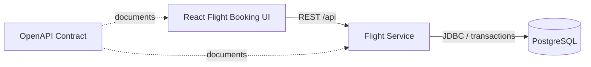

# AeroWay

AeroWay is a full-stack flight booking system focused on reliable seat inventory and reservation consistency.

The system supports flight search, seat availability, temporary seat holds, booking confirmation, payment outcome simulation, cancellation, and conflict handling for concurrent reservation requests. PostgreSQL constraints and transactional reservation logic protect seat availability so the same physical seat cannot be actively held or confirmed more than once.

Flight inventory is seeded from public OpenFlights airport, airline, and route datasets and stored in PostgreSQL as AeroWay bookable inventory.

## Core Capabilities

- Browse airport, airline, and route-based flight inventory
- Filter by origin, destination, date, airline, cabin, price, direct flight, and departure time
- Review flight details including airport names, carrier, aircraft, duration, fares, baggage note, and available seats
- View live seat availability
- Select and temporarily hold an available seat
- Enter passenger name, email, document number, and passenger type
- Complete a booking from an active seat hold
- Reuse idempotency keys for repeated checkout confirmation requests
- Simulate payment success and payment failure outcomes
- View booking confirmation details
- Cancel confirmed bookings and release the seat back into inventory
- Receive clear conflict feedback when a seat is already booked
- Validate double-booking protection with automated high-concurrency tests

## Tech Stack

Backend:

- Java 21
- Spring Boot
- JDBC/JdbcTemplate
- PostgreSQL
- Flyway
- OpenAPI/Swagger

Frontend:

- React
- TypeScript
- Vite

Testing:

- JUnit 5
- Testcontainers
- Integration and concurrency tests

Dev setup:

- Docker Compose

## Architecture



The current system contains one backend service, `flight-service`, with internal service boundaries for flight inventory reads and reservation lifecycle commands. The design remains extensible for future hotel, payment, itinerary, and coordination services.

## Run the Application

From the repository root:

```bash
docker compose up --build
```

Open:

- Flight booking UI: `http://localhost:5173`
- Backend API: `http://localhost:8080`
- Swagger UI: `http://localhost:8080/swagger-ui/index.html`

## Booking Flow

1. Search or filter available flights.
2. Review flight details and the seat map.
3. Select an available seat.
4. Create a temporary seat hold.
5. Enter passenger details.
6. Confirm the booking with an idempotency key.
7. Process the simulated payment outcome.
8. Review the booking confirmation.
9. Cancel the booking when required; the seat becomes available again.

## Availability

AeroWay uses PostgreSQL as the source of truth for seat reservations. The `seat_reservations` table has a partial unique index on active reservations, which guarantees that only one active hold or confirmed reservation can exist for the same seat on the same flight.

If two booking requests race at the same time, the database accepts one active booking state and rejects the rest. The service converts duplicate-key violations into HTTP `409 Conflict` responses, and the UI displays a clear seat-conflict message.

## Run Backend Tests

```bash
cd services/flight-service
mvn test
```

The backend test suite uses Testcontainers, so Docker must be running.

## API

The OpenAPI contract is available in:

```text
openapi/flight-service.yaml
```

Main endpoints:

- `GET /api/flights`
- `GET /api/flights/{flightId}`
- `GET /api/flights/{flightId}/seats`
- `POST /api/flights/{flightId}/seats/{seatId}/holds`
- `POST /api/flights/{flightId}/seats/{seatId}/reservations`
- `GET /api/reservations/{reservationId}`
- `POST /api/reservations/{reservationId}/confirm`
- `POST /api/reservations/{reservationId}/cancel`

## Data Source

AeroWay seeds flight inventory from the public OpenFlights airport, airline, and route datasets:

```text
https://openflights.org/data.php
```

The OpenFlights route data is historical, so AeroWay uses it as representative flight inventory rather than live airline availability. Actual seat reservations are handled by AeroWay's own PostgreSQL tables.

Reload all seed data from scratch during local development:

```bash
docker compose down -v
docker compose up --build
```

## Future Extensions

- More flight search filters
- Multi-passenger bookings
- Hotel reservations
- Itinerary management
- External payment authorization
- Saga-based coordination across services
