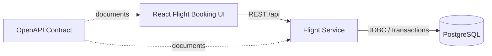

# AeroWay

AeroWay is a full-stack flight booking application focused on safe seat reservations.

Users can browse available flights, inspect the seat map, choose an available seat, enter passenger details, and complete a booking. The backend protects seat availability with PostgreSQL constraints and transactional reservation logic, so the same flight seat cannot be booked twice even under concurrent requests.

The sample flight inventory is generated from public OpenFlights airport, airline, and route datasets, then stored locally in PostgreSQL as AeroWay bookable inventory.

## Core Capabilities

- Browse flights
- Browse realistic airport, airline, and route-based inventory
- Filter by origin, destination, date, airline, cabin, price, direct flight, and departure time
- Review flight details including airport names, carrier, aircraft, duration, fares, baggage note, and available seats
- View live seat availability
- Select an available seat
- Enter passenger name, email, document number, and passenger type
- Complete a seat reservation
- View booking confirmation details
- Cancel confirmed bookings and release the seat back into inventory
- Receive clear conflict feedback when a seat is already booked
- Validate availability integrity under high-concurrency booking attempts

## Tech Stack

Backend:

- Java 21
- Spring Boot
- JDBC/JdbcTemplate
- PostgreSQL
- Flyway
- OpenAPI/Swagger

Frontend:

- React
- TypeScript
- Vite

Testing:

- JUnit 5
- Testcontainers
- Integration and concurrency tests

Dev setup:

- Docker Compose

## Architecture



The current system has one backend service, `flight-service`, because flight inventory and seat reservation are the core domain. The design remains extensible for future hotel, payment, and itinerary services.

## Run The Application

From the repository root:

```bash
docker compose up --build
```

Open:

- Flight booking UI: `http://localhost:5173`
- Backend API: `http://localhost:8080`
- Swagger UI: `http://localhost:8080/swagger-ui/index.html`

## Booking Flow

1. Open the flight booking UI.
2. Search or filter available flights.
3. Review flight details and the seat map.
4. Select an available seat.
5. Enter passenger details.
6. Complete the booking.
7. Review the booking confirmation.
8. Cancel the booking if needed; the seat becomes available again.

## Availabilitying

AeroWay uses PostgreSQL as the source of truth for seat reservations. The `seat_reservations` table has a unique constraint on `(flight_id, seat_id)`, which guarantees that only one reservation can exist for the same seat on the same flight.

If two booking requests race at the same time, the database accepts one insert and rejects the rest. The service converts duplicate-key violations into HTTP `409 Conflict` responses, allowing the UI to show a clear message: the seat has already been reserved.

## Run Backend Tests

```bash
cd services/flight-service
mvn test
```

The backend test suite uses Testcontainers, so Docker must be running.

## API

The OpenAPI contract is available in:

```text
openapi/flight-service.yaml
```

Main endpoints:

- `GET /api/flights`
- `GET /api/flights/{flightId}`
- `GET /api/flights/{flightId}/seats`
- `POST /api/flights/{flightId}/seats/{seatId}/reservations`
- `GET /api/reservations/{reservationId}`
- `POST /api/reservations/{reservationId}/cancel`
- `POST /api/availability/integrity-check`

The last endpoint powers the availability integrity check in the UI.

## Data Source

AeroWay seeds realistic sample inventory from the public OpenFlights airport, airline, and route datasets:

```text
https://openflights.org/data.php
```

The OpenFlights route data is historical, so AeroWay uses it as realistic sample inventory rather than live airline availability. Actual seat reservations are handled by AeroWay's own PostgreSQL tables.

To reload all seed data from scratch during local development:

```bash
docker compose down -v
docker compose up --build
```

## Future Extensions

- More flight search filters
- Multi-passenger bookings
- Booking cancellation
- Payment authorization
- Hotel reservations
- Itinerary management
- Idempotency keys for retries
- Saga-based coordination across services
