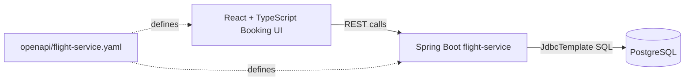

# AeroWay Architecture

## Current MVP

AeroWay is intentionally focused. The current system has one backend service, `flight-service`, one PostgreSQL database, and one React frontend. This keeps the product goal clear: safely reserving a scarce flight seat while keeping the application easy to run and extend.

The local database is seeded with realistic sample inventory derived from public OpenFlights airport, airline, and route datasets. AeroWay then creates its own bookable flight instances and seat inventory on top of that reference data.

## Why One Backend Service For Now

The application can become a larger travel booking platform, but the current version keeps one service because flight inventory and seat reservation are the core workflow. A single service makes it clear where the reservation logic lives, how the database constraint works, and how the tests prove correctness.

## API-First Development

The OpenAPI file documents the public contract for listing flights, listing seats, and managing reservations. This makes the frontend/backend boundary explicit and keeps the UI from depending on hidden implementation details.

## Frontend And Backend Communication

The frontend calls relative `/api` URLs. In local development and Docker Compose, Vite proxies these requests to the Spring Boot backend. This keeps the frontend code simple while allowing the backend to remain a separately deployable service.

## Path To More Microservices

AeroWay can evolve into five services without changing the core lesson:

- `flight-service` owns flight seats and reservations.
- `hotel-service` can own room inventory.
- `booking-service` can coordinate a complete trip.
- `payment-service` can authorize and capture payment.
- A recommendation service can suggest trips or itineraries.

At that point, cross-service workflows would need stronger patterns such as sagas, idempotency keys, retries, and observability. Those are future extensions, not part of the current MVP.
